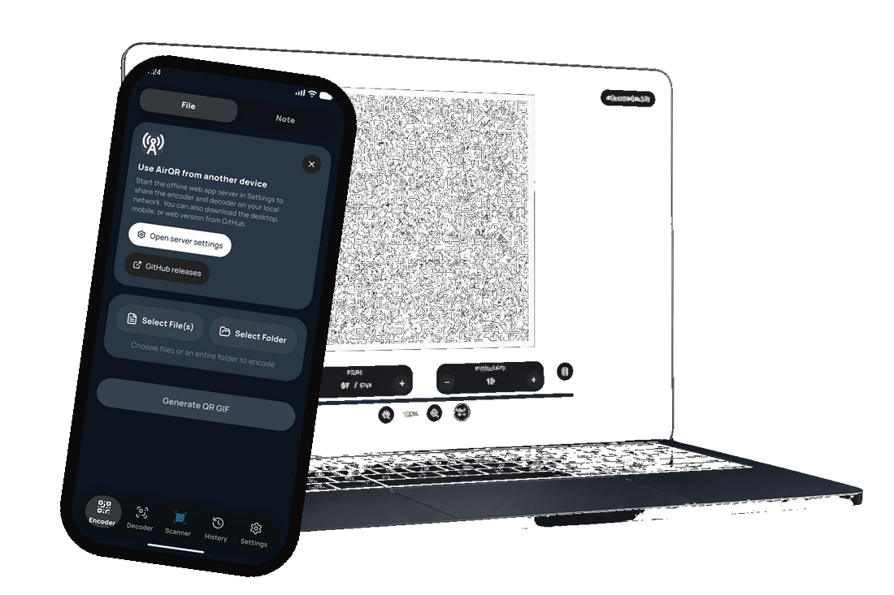

<p align="center">
  
</p>

<h1 align="center">AirQR — Air-Gapped File Transfer via Animated QR Codes</h1>

<p align="center"><strong>Move any file between devices with light: no cable, no internet, no Bluetooth, no pairing.</strong></p>

<p align="center">
  
</p>

<p align="center">
  <a href="https://github.com/Thunzyy/AirQR/stargazers"></a>
  <a href="LICENSE"></a>
  <a href="https://airqr-demo.pgnrd.fr"></a>
  
</p>

<p align="center">
  <a href="https://play.google.com/store/apps/details?id=com.airqr.mobile" target="_blank" rel="noopener noreferrer">
    
  </a>
  
  <a href="https://apps.microsoft.com/detail/9P90L5TKGMD5" target="_blank" rel="noopener noreferrer">
    
  </a>
</p>

<p align="center">
  <a href="https://airqr-demo.pgnrd.fr" target="_blank" rel="noopener noreferrer"></a>
</p>

<p align="center">
  <a href="https://get-airqr.pgnrd.fr/">Get AirQR</a>
  ·
  <a href="https://lucas.pgnrd.fr/en/blog/airqr">Blog</a>
  ·
  <a href="docs/deployment/README.md">Install guide</a>
</p>

**AirQR** is an open-source, air-gapped file-transfer tool. It encodes a file into a looping **animated QR-code GIF** using **RaptorQ fountain codes**, then rebuilds the original on another device by scanning the screen. Missing or corrupted frames are tolerated: the receiver does not need every frame, only enough unique packets. Inspired by [divan's txqr](https://github.com/divan/txqr).

Typical reproducible throughput on an iPhone 12 scanning a laptop is about **8 KB/s** (~2 seconds for a 13 KB payload). AirQR is not a Wi-Fi replacement. It is for cases where pairing, network, or cables are unavailable or undesirable: secrets, configs, air-gapped machines, two devices that should not share a LAN.


<p align="center">
  
</p>

## Contents

- [What AirQR is](#what-airqr-is)
- [How it works](#how-it-works)
- [Features](#features)
- [Quick start](#quick-start)
- [Compared to other transports](#compared-to-other-transports)
- [Documentation](#documentation)
- [Repository layout](#repository-layout)
- [License](#license)

## What AirQR is

AirQR turns a file, folder, or note into an animated QR GIF on one screen. A phone, tablet, or second computer points its camera at that screen and reconstructs the file locally.

| Surface | Runtime |
| --- | --- |
| Web app | Rust compiled to WebAssembly, React + Vite |
| iPhone / Android / desktop | Flutter calling the same Rust engine over FFI |
| Portable HTML | Single offline file, no install |
| Sync server (optional) | Python + SQLite, for resume and multi-device scans |


**Use it when you need to move data without a network path:** SSH keys, WireGuard configs, 2FA backups, small documents, or any payload between an air-gapped PC and a phone.

## How it works

<table>
  <tr>
    <td align="center" valign="top" width="33%">
      
      <p><strong>1. Choose</strong><br />File, folder, or note</p>
    </td>
    <td align="center" valign="top" width="33%">
      
      <p><strong>2. Encode</strong><br />RaptorQ packets become QR frames</p>
    </td>
    <td align="center" valign="top" width="33%">
      
      <p><strong>3. Scan</strong><br />Hold until the progress bar fills</p>
    </td>
  </tr>
</table>

[Fountain codes](https://en.wikipedia.org/wiki/Fountain_code) make this practical. A naive QR slideshow fails if you miss one frame. RaptorQ is rateless: any *K + ε* unique packets rebuild the file, in any order. With 20% overhead, scanning about 83% of the generated frames is enough. The GIF loops until the decoder is done.


## Features

- **Air-gapped by default** — no internet, Bluetooth, Wi-Fi, or USB required for a one-screen to one-camera transfer
- **No pairing, no account, no upload** — data stays on the devices; the GIF is the transport
- **Fountain-code resilience** — missed frames do not block the transfer
- **Same engine everywhere** — Rust core for WASM (web) and native (Flutter)
- **Optional multi-device resume** — a Python sync server can fill packet gaps across scanners
- **Portable HTML** — encode and decode from one file, including on a locked-down machine
- **Smart benchmark** — finds FPS / packet size / ECC for your hardware

## Quick start

Full install guide (local, Docker, home screen): [docs/deployment/README.md](docs/deployment/README.md)

### Downloads

<p align="center">
  <a href="https://airqr-demo.pgnrd.fr"></a>
  <a href="https://get-airqr.pgnrd.fr"></a>
  <a href="https://github.com/Thunzyy/AirQR/releases/download/v1.0/airqr-portable.html"></a>
  <a href="https://github.com/Thunzyy/AirQR/releases/download/v1.0/AirQR-windows-x64-setup.exe"></a>
  <a href="https://github.com/Thunzyy/AirQR/releases/download/v1.0/AirQR-linux-x64.deb"></a>
</p>

- Windows: [Microsoft Store](https://apps.microsoft.com/detail/9P90L5TKGMD5) — recommended for automatic updates.
- Android: [Google Play](https://play.google.com/store/apps/details?id=com.airqr.mobile)
- iPhone: ~~App Store~~ — **Coming soon**. Use the [web app](https://airqr-demo.pgnrd.fr/) in Safari.
- All builds: [get-airqr.pgnrd.fr](https://get-airqr.pgnrd.fr)
- Releases: [AirQR v1.0](https://github.com/Thunzyy/AirQR/releases/tag/v1.0)


### Docker

```bash
docker compose up -d --build

# Open http://localhost:8081
```

### Source

Windows:

```bat
start.bat -http
```

Linux / macOS:

```bash
./start.sh -http
```

This launches the Vite frontend and the optional Python sync server. API and WebSocket requests are proxied automatically.

```bash
git clone https://github.com/Thunzyy/AirQR.git
cd AirQR
```

## Compared to other transports

AirQR is slower than NFC, Bluetooth, AirDrop, or Wi-Fi. Its value is what it does **not** need.

| Transport | Typical throughput | 13 KB | Needs |
| --- | ---: | ---: | --- |
| **AirQR** (this project, iPhone 12 / laptop) | ~8 KB/s | ~2 s | Camera + screen |
| NFC | ~50 KB/s | ~260 ms | NFC radios, tap |
| Bluetooth 5 | ~250 KB/s | ~50 ms | Pairing / discovery |
| AirDrop | ~40 MB/s | < 1 ms | Apple IDs / handshake |
| Wi-Fi 6 | ~150 MB/s | negligible | Same network |

Wi-Fi is on the order of **5,000×** faster. Use AirQR when those channels are blocked, untrusted, or more friction than two seconds of scanning.

## Documentation

- [Install and deployment](docs/deployment/README.md) — local run, Docker, home screen
- [Architecture](docs/architecture/README.md) — Mermaid diagrams, encode/decode internals, deep dive
- [Sync server](services/sync-server/README.md) — CLI, auth, API (optional)
- [Build scripts](build/README.md) — portable HTML, desktop and mobile bundles
- [Tests](tests/README.md) — Vitest, Playwright, Pytest, Cargo
- Blog: [Animated QR transfer](docs/blog/airqr-animated-qr-transfer.mdx)
- Machine-readable overview: [llms.txt](llms.txt)

## Repository layout

| Path | What it holds |
| --- | --- |
| `packages/airqr-core/` | Rust engine: payloads, RaptorQ packets, QR and GIF rendering, decoding |
| `apps/web/` | Web app (React, Vite, TypeScript) running the engine through WASM |
| `apps/flutter/` | Mobile and desktop app calling the same Rust engine natively |
| `apps/get-airqr/` | Static download page at get-airqr.pgnrd.fr |
| `services/sync-server/` | Optional Python server for shared history, resume, and multi-device scans |
| `build/` | Python build scripts producing the portable HTML and app bundles |
| `tests/` | Web (Vitest, Playwright) and Python (Pytest) suites |
| `shared/`, `assets/` | Shared icons and brand assets |
| `docs/` | Documentation, architecture diagrams, and blog |


## License

[MIT](LICENSE) — Copyright (c) 2026 Lucas Poignard
