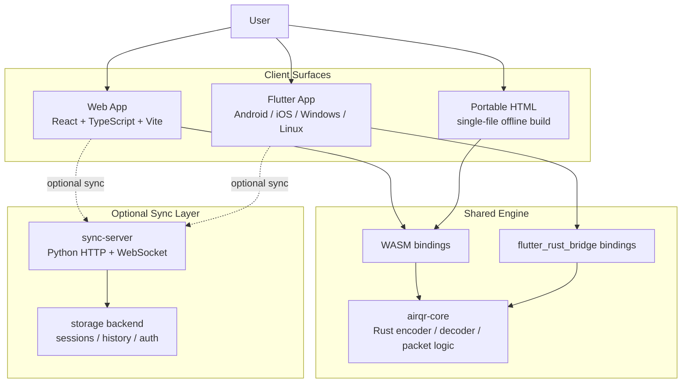
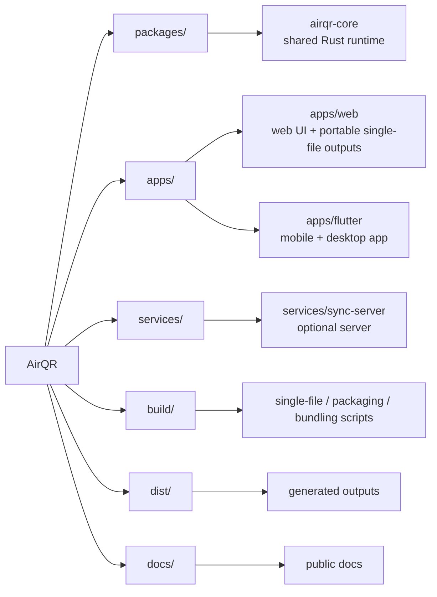
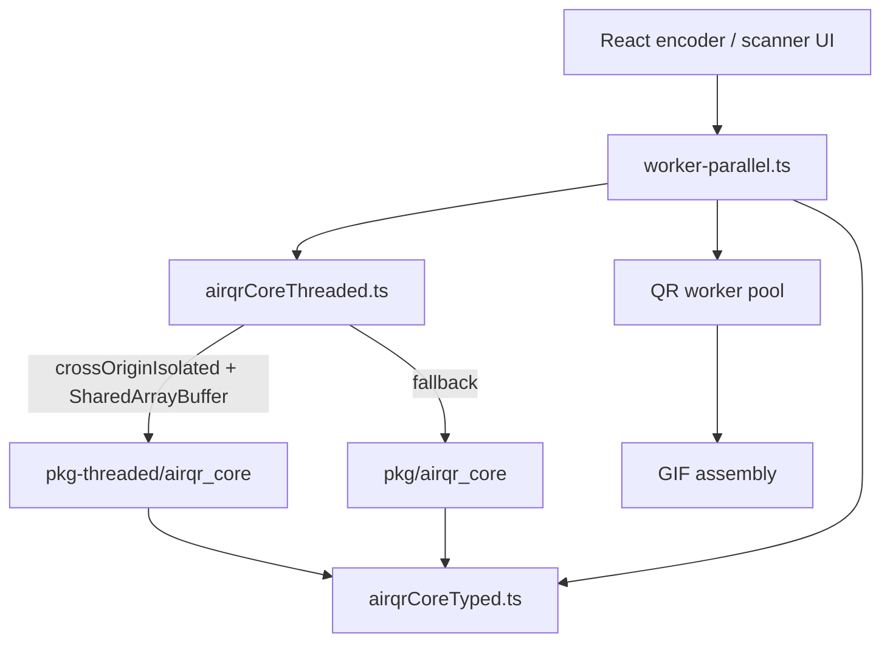
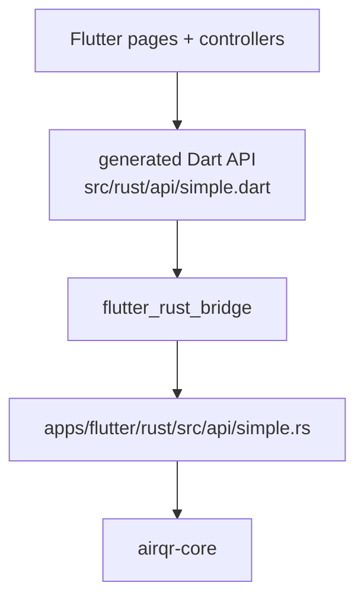
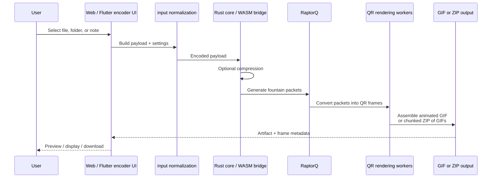
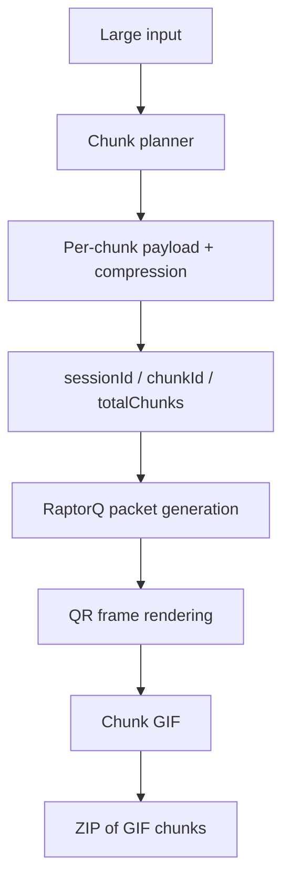
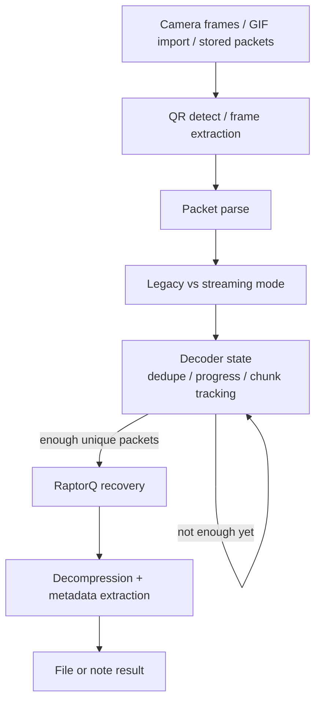
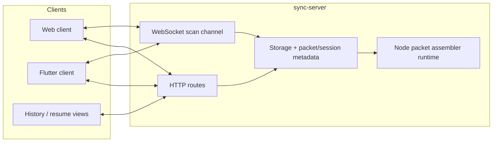
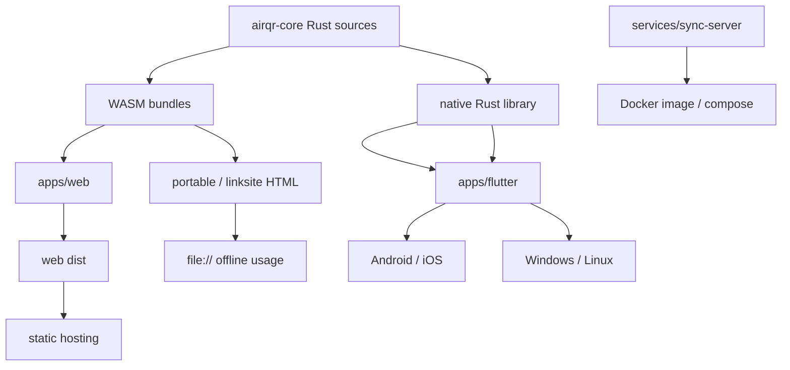
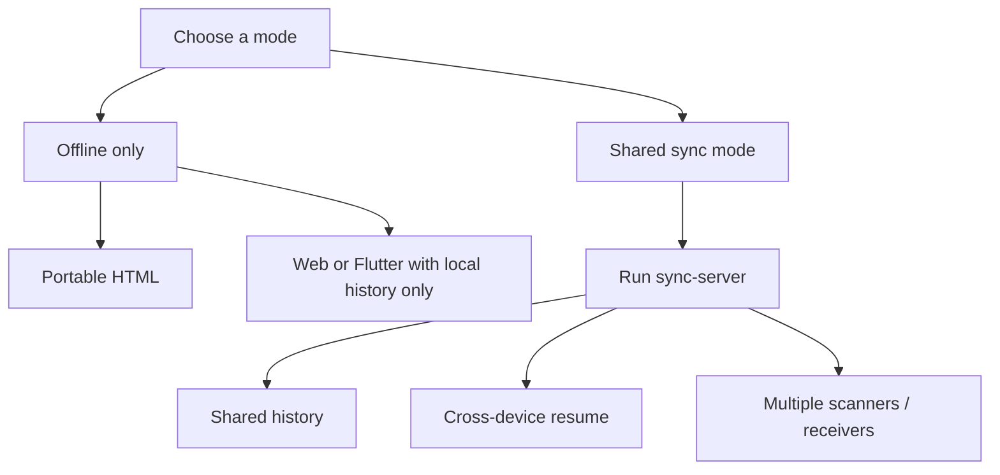

# AirQR Architecture Diagrams

This page contains the public Mermaid diagrams for the repo. It focuses on structure and data flow.

If you want the low-level codec flow, read [ENCODE_DECODE_DIAGRAMS.md](./ENCODE_DECODE_DIAGRAMS.md). For the detailed prose explanation behind the diagrams, read [DEEP_DIVE.md](./DEEP_DIVE.md).

## 1. System Overview

## 2. Repository Responsibilities

## 3. Web Runtime And WASM Selection

## 4. Flutter Runtime And Native Bridge

## 5. Encoding Pipeline

## 6. Streaming Encode And Chunking

## 7. Decode Pipeline

## 8. Multi-Device Sync

## 9. Build And Distribution

## 10. Operational Modes

