# AirQR Encode / Decode Diagrams

This page zooms into the low-level mechanics of the codec. It explains what happens between:

- file, folder, or note input
- bytes and metadata layout
- optional compression
- RaptorQ packet generation
- QR frame rendering in black and white
- GIF or chunked ZIP assembly
- live scanning, packet parsing, deduplication, recovery, decompression, and final result

For the broader system view, read [DIAGRAMS.md](./DIAGRAMS.md). For prose explanations and file-level references, read [DEEP_DIVE.md](./DEEP_DIVE.md).

## 1. Normal Encode Flow, End To End

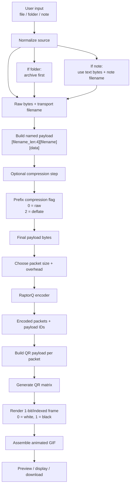

## 2. Payload Construction

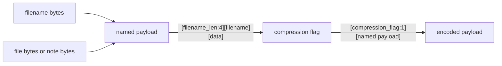

### Named payload layout

```text
[ filename_len: 4 bytes, big-endian ]
[ filename bytes ]
[ original content bytes ]
```

### Compression flag values used by the client surfaces

```text
0 = raw payload
2 = deflate-compressed payload
```

## 3. Packetization With RaptorQ

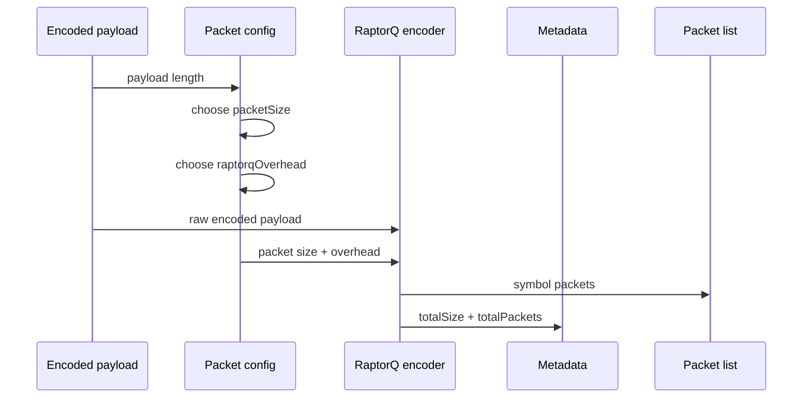

The important property here is that the receiver does not need every frame in order. It only needs enough unique packets for successful recovery.

## 4. Normal QR Payload Layout

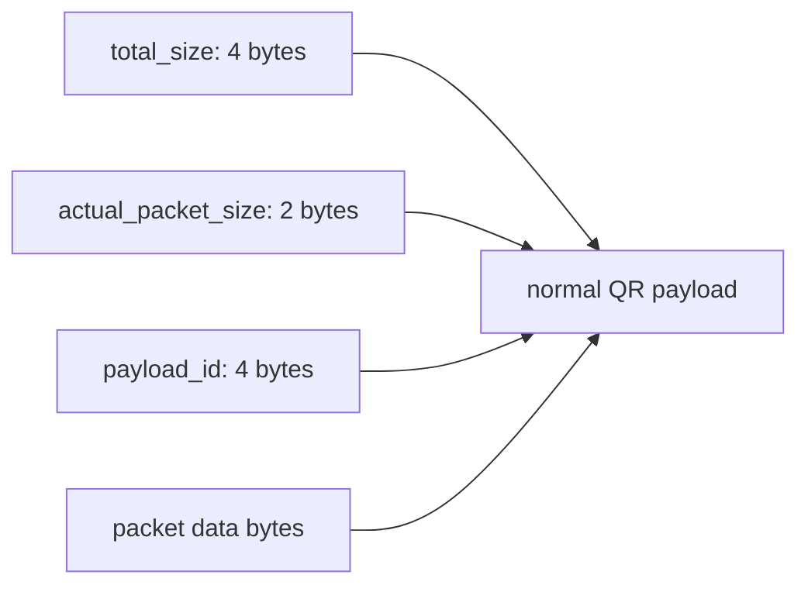

### Normal QR payload layout

```text
[ total_size: 4 ]
[ actual_packet_size: 2 ]
[ payload_id: 4 ]
[ packet data bytes ]
```

## 5. Streaming QR Payload Layout

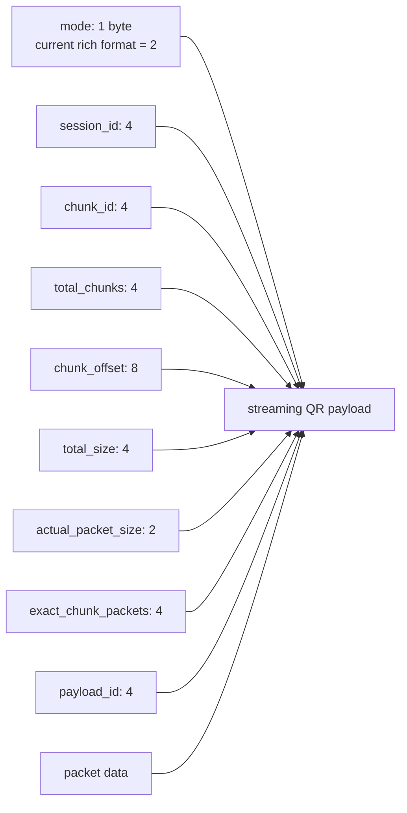

### Streaming QR payload layout

```text
[ mode: 2 ]
[ session_id: 4 ]
[ chunk_id: 4 ]
[ total_chunks: 4 ]
[ chunk_offset: 8 ]
[ total_size: 4 ]
[ actual_packet_size: 2 ]
[ exact_chunk_packets: 4 ]
[ payload_id: 4 ]
[ packet data bytes ]
```

This diagram shows the current richer streaming header with `exact_chunk_packets`, which corresponds to mode `2`. The decoder still accepts the older mode `1` variant documented later on this page.

## 6. QR Rendering To Black And White Frames

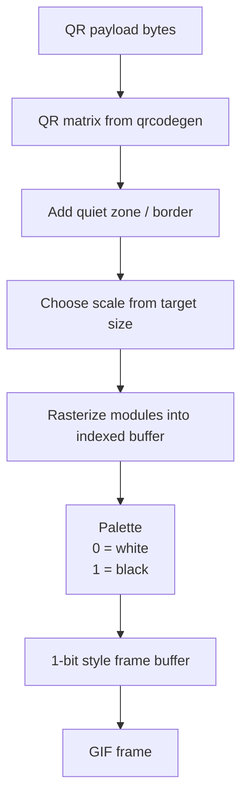

What actually happens at this stage:

- each QR module is expanded into a square of pixels
- the buffer is indexed, not full RGBA
- the exported GIF palette is effectively two colors: white and black
- this keeps the frames compact and scannable

## 7. Web Encode Runtime, Detailed

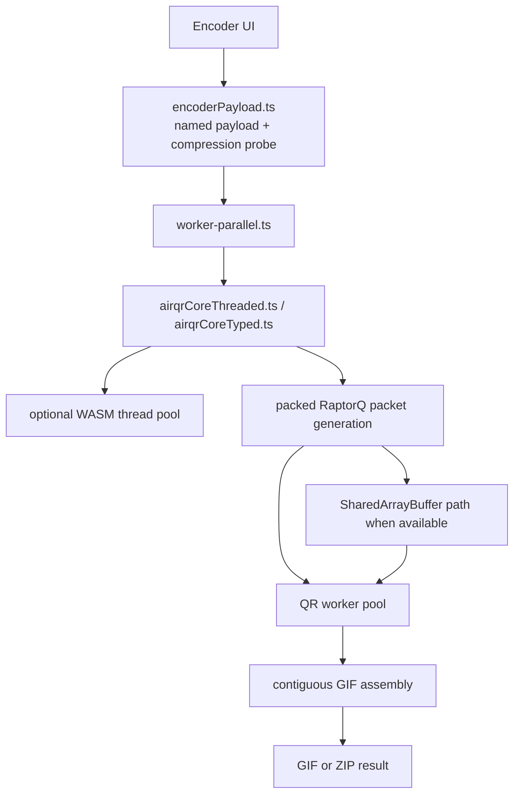

This is why the web app is not just “Rust in the browser”. The heavy pipeline is split between:

- Rust/WASM for packet and QR logic
- workers for parallel frame rendering
- JavaScript orchestration for packing, batching, and GIF assembly

## 8. Chunked Encode Flow

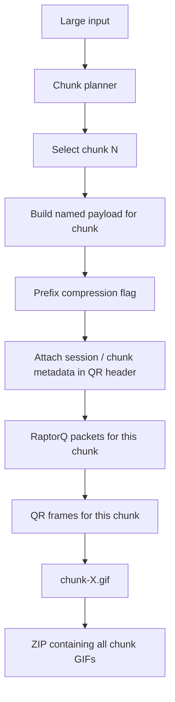

The payload still carries filename metadata inside the chunk payload, while the QR header carries transport metadata for chunk ordering and resume.

## 9. Live Decode Flow, End To End

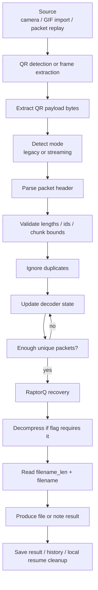

## 10. Decode State In Legacy Mode

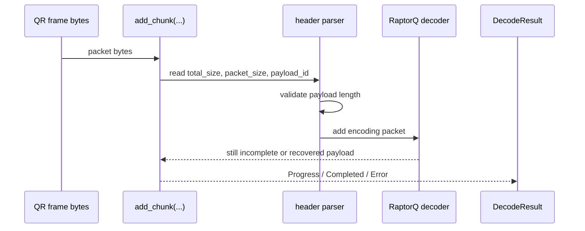

On completion:

1. the decoder reconstructs the encoded payload
2. the compression flag is read
3. the payload is decompressed if needed
4. `filename_len` and `filename` are read
5. the remaining bytes become the final file or note content

## 11. Decode State In Streaming Mode

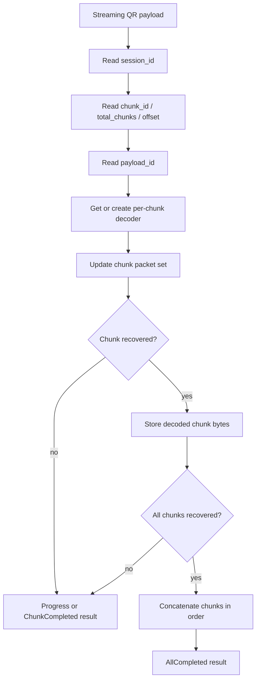

This is where the streaming decoder tracks:

- session id
- total chunk count
- which chunk decoders exist
- which chunks are already completed
- temporary decoded chunk buffers
- overall progress

## 12. Sync-Aware Decode And Resume

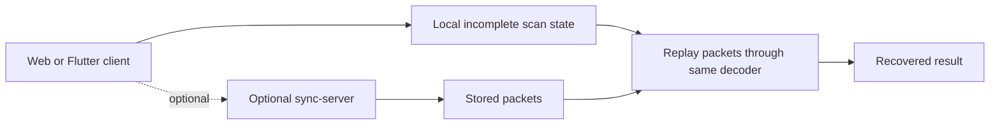

Resume does not use a different decode algorithm. It replays previously stored packets through the same Rust decoder state machine.

## 13. Where Notes Differ From Generic Files

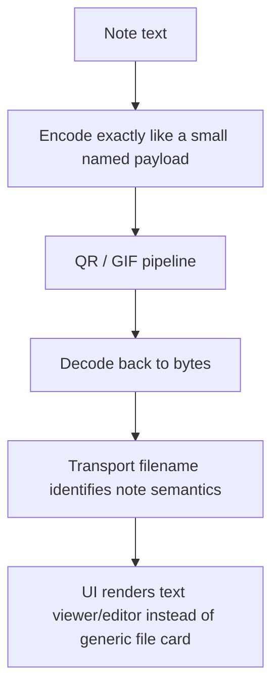

At the codec layer, notes are still bytes plus filename metadata. The note-specific behavior happens mostly in the client UI after decoding.

## 14. Byte-Level View Of A Normal QR Packet

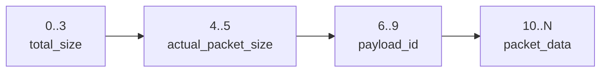

### Normal packet offsets

| Offset | Size | Field | Meaning |
| --- | ---: | --- | --- |
| `0` | `4` | `total_size` | Size of the encoded payload before RaptorQ splitting |
| `4` | `2` | `actual_packet_size` | Actual byte length of this packet's data section |
| `6` | `4` | `payload_id` | RaptorQ payload id / symbol id |
| `10` | variable | `packet_data` | Raw RaptorQ packet payload bytes |

This is the header parsed by the normal decoder in `packages/airqr-core/src/lib.rs`.

## 15. Byte-Level View Of A Streaming Packet, Mode 2

Mode `2` is the current richer streaming header used by the web/WASM path and by the Rust streaming encoder. It adds `exact_chunk_packets`.

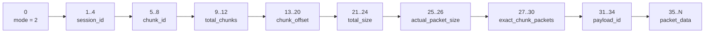

### Streaming mode 2 offsets

| Offset | Size | Field | Meaning |
| --- | ---: | --- | --- |
| `0` | `1` | `mode` | `2` = streaming packet with exact chunk packet count |
| `1` | `4` | `session_id` | Transfer/session identifier |
| `5` | `4` | `chunk_id` | Current chunk number |
| `9` | `4` | `total_chunks` | Total number of chunks in this transfer |
| `13` | `8` | `chunk_offset` | Byte offset of this chunk inside the original file |
| `21` | `4` | `total_size` | Encoded payload size for this chunk |
| `25` | `2` | `actual_packet_size` | Actual byte length of the packet payload |
| `27` | `4` | `exact_chunk_packets` | Exact number of packets expected for this chunk |
| `31` | `4` | `payload_id` | RaptorQ payload id / symbol id |
| `35` | variable | `packet_data` | Raw RaptorQ packet payload bytes |

This is the layout produced by `build_streaming_qr_data(...)` in `packages/airqr-core/src/wasm.rs`.

## 16. Byte-Level View Of A Streaming Packet, Mode 1

Mode `1` is still accepted by the streaming decoder for compatibility. It is used by the Flutter-native streaming encode helper and older streaming paths that do not carry `exact_chunk_packets`.

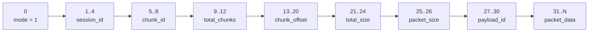

### Streaming mode 1 offsets

| Offset | Size | Field | Meaning |
| --- | ---: | --- | --- |
| `0` | `1` | `mode` | `1` = streaming packet without exact chunk packet count |
| `1` | `4` | `session_id` | Transfer/session identifier |
| `5` | `4` | `chunk_id` | Current chunk number |
| `9` | `4` | `total_chunks` | Total number of chunks in this transfer |
| `13` | `8` | `chunk_offset` | Byte offset of this chunk inside the original file |
| `21` | `4` | `total_size` | Encoded payload size for this chunk |
| `25` | `2` | `packet_size` | Nominal packet size |
| `27` | `4` | `payload_id` | RaptorQ payload id / symbol id |
| `31` | variable | `packet_data` | Raw RaptorQ packet payload bytes |

The streaming decoder in `packages/airqr-core/src/streaming.rs` accepts both mode `1` and mode `2`.

## 17. Reconstructed Payload After RaptorQ

After the decoder has received enough unique packets, RaptorQ reconstructs the encoded payload. That reconstructed payload is not yet the final file. It still contains the compression flag and the named payload.

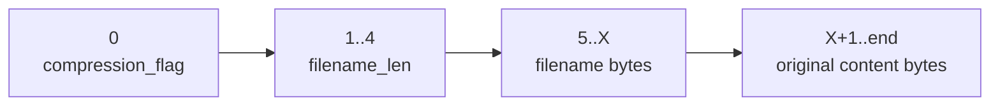

### Reconstructed payload layout

| Offset | Size | Field | Meaning |
| --- | ---: | --- | --- |
| `0` | `1` | `compression_flag` | `0` = raw, `2` = deflate |
| `1` | `4` | `filename_len` | Big-endian filename byte length |
| `5` | variable | `filename` | Original transport filename |
| after filename | variable | `content` | Final file bytes or note text bytes |

Decode completion therefore requires:

1. RaptorQ recovery
2. reading `compression_flag`
3. optional decompression
4. reading `filename_len`
5. extracting `filename`
6. returning the remaining bytes as the final content

## 18. How The Decoder Chooses Legacy vs Streaming

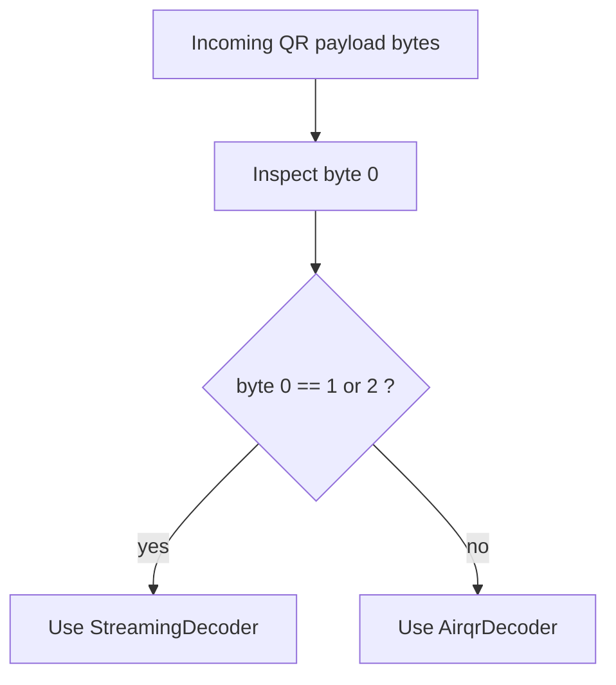

This heuristic is used in the Flutter-facing API layer. The normal decoder then expects the non-streaming header beginning with `total_size`, while the streaming decoder expects one of the explicit mode bytes.

## 19. What Makes The Output Scannable

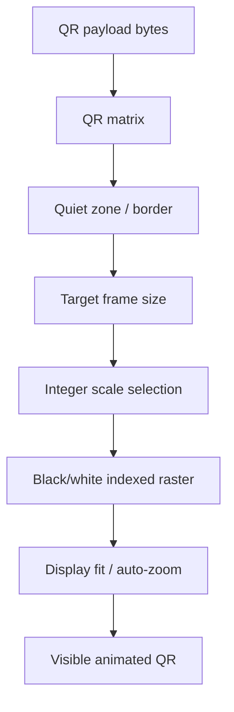

The main practical scannability constraints are:

- packet size must stay small enough for the chosen QR capacity
- the QR matrix must keep a proper border
- the rendered output must stay fully visible on screen
- the animation speed must remain readable by the receiving camera

That is why the repo pays attention to:

- packet-size tuning
- ECC level
- target size and scale
- fully-visible preview fit
- GIF frame timing

## 20. Folder And Note Specializations

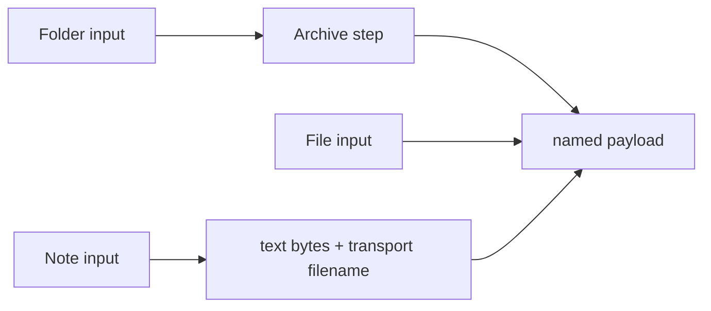

The important point is that the codec only sees named bytes. The specialization happens before encoding:

- folders are archived first
- notes are turned into text bytes
- files pass through directly

After that, they all follow the same packet, QR, GIF, and decode machinery.
