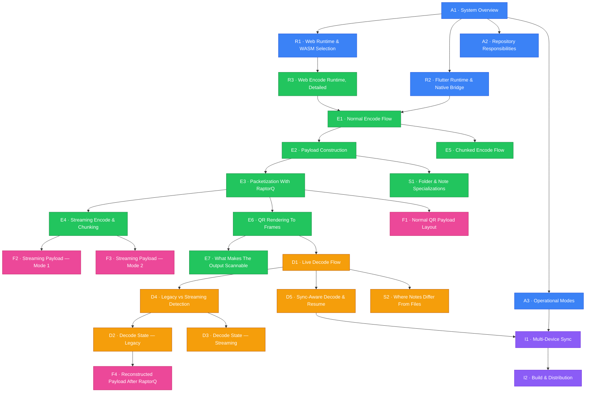

# AirQR Architecture Map

Visual map of every architecture diagram in the project. Use the index below the diagram to jump to any detailed view.

---

### Index

#### Architecture & Runtimes (blue)

| ID | Diagram | Link |
|----|---------|------|
| A1 | System Overview | [DIAGRAMS.md #1](DIAGRAMS.md#1-system-overview) |
| A2 | Repository Responsibilities | [DIAGRAMS.md #2](DIAGRAMS.md#2-repository-responsibilities) |
| A3 | Operational Modes | [DIAGRAMS.md #6](DIAGRAMS.md#6-operational-modes) |
| R1 | Web Runtime & WASM Selection | [DIAGRAMS.md #3](DIAGRAMS.md#3-web-runtime-and-wasm-selection) |
| R2 | Flutter Runtime & Native Bridge | [DIAGRAMS.md #4](DIAGRAMS.md#4-flutter-runtime-and-native-bridge) |

#### Encoding Pipeline (green)

| ID | Diagram | Link |
|----|---------|------|
| E1 | Normal Encode Flow, End To End | [ENCODE_DECODE #1](ENCODE_DECODE_DIAGRAMS.md#1-normal-encode-flow-end-to-end) |
| E2 | Payload Construction | [ENCODE_DECODE #2](ENCODE_DECODE_DIAGRAMS.md#2-payload-construction) |
| E3 | Packetization With RaptorQ | [ENCODE_DECODE #3](ENCODE_DECODE_DIAGRAMS.md#3-packetization-with-raptorq) |
| E4 | Streaming Encode & Chunking | [DIAGRAMS.md #5](DIAGRAMS.md#5-streaming-encode-and-chunking) |
| E5 | Chunked Encode Flow | [ENCODE_DECODE #8](ENCODE_DECODE_DIAGRAMS.md#8-chunked-encode-flow) |
| E6 | QR Rendering To Frames | [ENCODE_DECODE #6](ENCODE_DECODE_DIAGRAMS.md#6-qr-rendering-to-black-and-white-frames) |
| E7 | What Makes The Output Scannable | [ENCODE_DECODE #19](ENCODE_DECODE_DIAGRAMS.md#19-what-makes-the-output-scannable) |
| R3 | Web Encode Runtime, Detailed | [ENCODE_DECODE #7](ENCODE_DECODE_DIAGRAMS.md#7-web-encode-runtime-detailed) |
| S1 | Folder & Note Specializations | [ENCODE_DECODE #20](ENCODE_DECODE_DIAGRAMS.md#20-folder-and-note-specializations) |

#### Decoding Pipeline (yellow)

| ID | Diagram | Link |
|----|---------|------|
| D1 | Live Decode Flow, End To End | [ENCODE_DECODE #9](ENCODE_DECODE_DIAGRAMS.md#9-live-decode-flow-end-to-end) |
| D2 | Decode State — Legacy Mode | [ENCODE_DECODE #10](ENCODE_DECODE_DIAGRAMS.md#10-decode-state-in-legacy-mode) |
| D3 | Decode State — Streaming Mode | [ENCODE_DECODE #11](ENCODE_DECODE_DIAGRAMS.md#11-decode-state-in-streaming-mode) |
| D4 | Legacy vs Streaming Detection | [ENCODE_DECODE #18](ENCODE_DECODE_DIAGRAMS.md#18-how-the-decoder-chooses-legacy-vs-streaming) |
| D5 | Sync-Aware Decode & Resume | [ENCODE_DECODE #12](ENCODE_DECODE_DIAGRAMS.md#12-sync-aware-decode-and-resume) |
| S2 | Where Notes Differ From Files | [ENCODE_DECODE #13](ENCODE_DECODE_DIAGRAMS.md#13-where-notes-differ-from-generic-files) |

#### Data Formats & Byte Layouts (pink)

| ID | Diagram | Link |
|----|---------|------|
| F1 | Normal QR Payload Layout | [ENCODE_DECODE #4](ENCODE_DECODE_DIAGRAMS.md#4-normal-qr-payload-layout) |
| F2 | Streaming Payload — Mode 1 | [ENCODE_DECODE #16](ENCODE_DECODE_DIAGRAMS.md#16-byte-level-view-of-a-streaming-packet-mode-1) |
| F3 | Streaming Payload — Mode 2 | [ENCODE_DECODE #5](ENCODE_DECODE_DIAGRAMS.md#5-streaming-qr-payload-layout) |
| F4 | Reconstructed Payload After RaptorQ | [ENCODE_DECODE #17](ENCODE_DECODE_DIAGRAMS.md#17-reconstructed-payload-after-raptorq) |

#### Infrastructure & Sync (purple)

| ID | Diagram | Link |
|----|---------|------|
| I1 | Multi-Device Sync | [DIAGRAMS.md #7](DIAGRAMS.md#7-multi-device-sync) |
| I2 | Build & Distribution | [DIAGRAMS.md #8](DIAGRAMS.md#8-build-and-distribution) |

---

### Related

- [DIAGRAMS.md](DIAGRAMS.md) -- system architecture and structure
- [ENCODE_DECODE_DIAGRAMS.md](ENCODE_DECODE_DIAGRAMS.md) -- low-level codec mechanics
- [DEEP_DIVE.md](DEEP_DIVE.md) -- prose explanation behind the diagrams
