<p align="center">
  
</p>

<h1 align="center">AirQR</h1>

<p align="center">Transférer des fichiers en QR animés avec des fountain codes et un benchmark intelligent</p>

<p align="center">
  <a href="https://airqr-demo.pgnrd.fr">Démo</a>
  ·
  <a href="https://get-airqr.pgnrd.fr/">Get AirQR — tous les téléchargements</a>
  ·
  <a href="https://github.com/Thunzyy/AirQR">GitHub</a>
</p>

<p align="center">
  <a href="https://play.google.com/store/apps/details?id=com.airqr.mobile">
    
  </a>
  
  <a href="https://apps.microsoft.com/detail/9P90L5TKGMD5">
    
  </a>
</p>

<p align="center">
  <a href="https://github.com/Thunzyy/AirQR/stargazers"></a>
</p>

> **TL;DR** : AirQR transfère des fichiers via des QR codes animés, encodés avec des fountain codes RaptorQ. L'app tourne dans le navigateur (Rust compilé en WebAssembly) et sur mobile (Flutter + Rust FFI). Un benchmark intégré cherche les meilleurs réglages pour *votre* paire écran/caméra. Débit reproductible autour de **8 Ko/s** sur un iPhone 12 — l'intérêt n'est pas la vitesse, c'est l'absence de réseau, de câble et d'appairage. Inspiré du [projet txqr de divan](https://github.com/divan/txqr).

AirQR encode un fichier en GIF de QR animés. L'autre appareil scanne jusqu'à avoir assez de paquets uniques, puis reconstruit l'original. Les frames manquantes ou corrompues sont tolérées : peu importe *lesquelles* arrivent, il en faut juste *assez*.

<p align="center">
  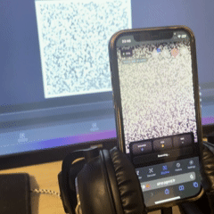
</p>

---

## Sommaire

- [Comment ça a commencé](#comment-ca-a-commence)
- [Comment ça s'utilise](#comment-ca-sutilise)
- [QR codes : capacité et limites](#qr-codes)
- [Fountain codes : pourquoi ça change tout](#fountain-codes)
- [Encodage parallèle](#encodage-parallele)
- [Streaming multi-chunk](#streaming-multi-chunk)
- [Reprise cross-device](#reprise-cross-device)
- [La stack technique](#stack-technique)
- [Trouver les réglages optimaux](#reglages-optimaux)
- [Benchmark & résultats](#benchmark-resultats)

---

<a id="comment-ca-a-commence"></a>

## Comment ça a commencé

Je cherchais un moyen de transférer des données sans réseau, sans Internet, sans Bluetooth, sans câble.

J'ai alors pensé aux QR codes, mais ceux-ci ne peuvent stocker au maximum que 7 089 caractères en numérique, et ~3 Ko en binaire. Premier problème : il allait falloir scanner plusieurs QR un à un, puis reconstituer le fichier — long et fastidieux, surtout pour les gros fichiers.

J'ai développé un premier prototype encodé en base64, puis je suis tombé sur [cet article](https://divan.dev/posts/animatedqr/) qui parlait du transfert via des QR animés encodés en bytes.

C'était exactement ce dont j'avais besoin : encoder des données en frames QR, les animer, et laisser une caméra les rescanner. Pas de réseau, pas d'appairage, pas de permissions.

Son projet, [txqr](https://github.com/divan/txqr), atteignait environ 9 Ko/s dans des conditions idéales, en Go, Gomobile et GopherJS. Un [article suivant sur les fountain codes](https://divan.dev/posts/fountaincodes/) a ensuite fait descendre 13 Ko à 500 ms — près de 25 kbps.

Et si on pouvait scanner avec un téléphone, et finir sur un autre ? Et si le tout tournait nativement dans le navigateur, sans backend Go, sans installation : un HTML pour encoder et décoder. Avec Flutter, plusieurs appareils peuvent aussi scanner le même gros fichier en parallèle pour accélérer le scan.

C'est comme ça qu'AirQR a démarré.

---

<a id="comment-ca-sutilise"></a>

## Comment ça s'utilise

<table>
  <tr>
    <td align="center" valign="top" width="33%">
      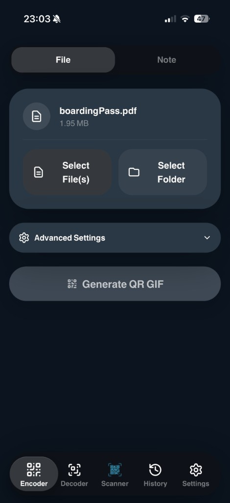
      <p><strong>1. Choisir</strong><br />Fichier, dossier ou note</p>
    </td>
    <td align="center" valign="top" width="33%">
      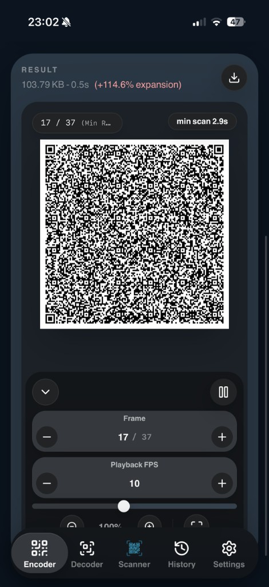
      <p><strong>2. Encoder</strong><br />Un GIF de QR animés (RaptorQ)</p>
    </td>
    <td align="center" valign="top" width="33%">
      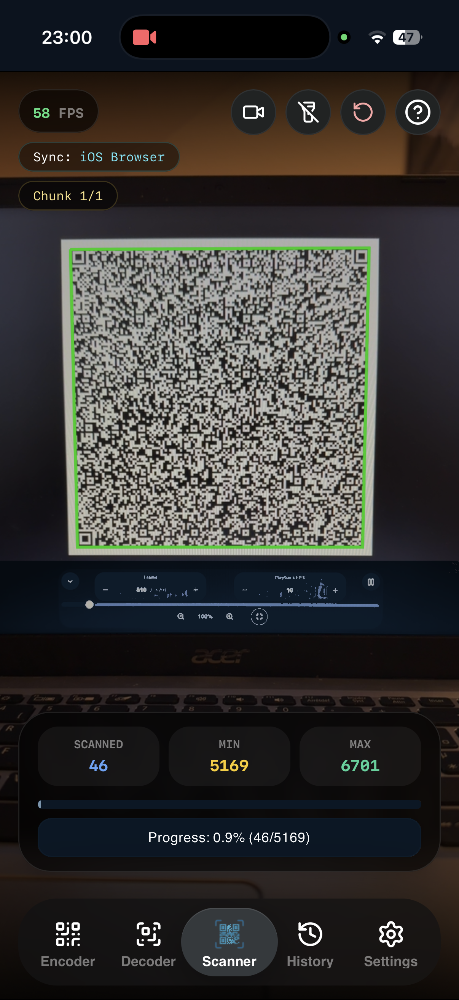
      <p><strong>3. Scanner</strong><br />Jusqu'à ce que la barre se remplisse</p>
    </td>
  </tr>
</table>

1. **Choisir un fichier** dans l'app web, mobile, ou le HTML portable.
2. **Encoder** : AirQR produit un GIF de QR animés (fountain codes RaptorQ).
3. **Afficher** le GIF en plein écran sur l'appareil émetteur.
4. **Scanner** avec l'autre appareil jusqu'à ce que la barre de progression se remplisse. Le fichier original est reconstruit localement.

Pas de compte, pas d'upload, pas de réseau obligatoire. Le serveur de sync n'entre en jeu que si vous voulez une reprise entre plusieurs scanners — il est optionnel.

---

<a id="qr-codes"></a>

## QR codes : capacité et limites

Un seul QR code (version 40, le plus grand) peut contenir :

| Niveau ECC | Capacité binaire | Moins l'en-tête de 10 octets |
|-----------|----------------|---------------------|
| Low (7%) | 2 953 octets | 2 943 octets |
| Medium (15%) | 2 331 octets | 2 321 octets |
| Quartile (25%) | 1 663 octets | 1 653 octets |
| High (30%) | 1 273 octets | 1 263 octets |

Soit ~3 Ko max par frame. Assez pour une URL, pas pour un fichier. La solution : les animer.

Afficher une séquence de QR suffisamment vite pour qu'une caméra reconstruise les données à partir des frames capturées.

Le problème du découpage naïf : si vous ratez ne serait-ce qu'une frame sur 200, vous êtes bloqué en attendant que l'animation boucle jusqu'à *cette* frame. Je vous laisse imaginer sur des fichiers à 13 000 frames...

C'est là que les fountain codes entrent en jeu.

---

<a id="fountain-codes"></a>

## Fountain codes : pourquoi ça change tout

Divan l'a magnifiquement expliqué dans son [article sur les fountain codes](https://divan.dev/posts/fountaincodes/), que je vous invite à lire avant de continuer.

Les fountain codes sont *sans taux fixe* : l'encodeur peut générer un flux potentiellement infini de paquets encodés uniques à partir des données originales. Le décodeur se fiche de *quels* paquets il reçoit, il faut juste qu'il en reçoive *assez*.

Voici rapidement le concept.

L'encodeur :

1. Découpe les données en K blocs source
2. Pour chaque paquet encodé, fait un XOR d'un sous-ensemble aléatoire de blocs source (la taille du sous-ensemble suit une *distribution de Soliton*)
3. Intègre l'identifiant du paquet pour que le décodeur sache quels blocs source ont été combinés

Le décodeur :

1. Collecte les paquets encodés
2. Quand il trouve un paquet contenant un seul bloc source → décodé immédiatement
3. Quand il trouve un paquet contenant deux blocs XORés, dont un déjà décodé → le XOR récupère l'autre
4. Ça cascade : chaque bloc nouvellement décodé en débloque d'autres

Avec une distribution bien calibrée, il faut environ **K × (1 + ε)** paquets pour récupérer K blocs source, où ε est un surplus modeste (j'utilise 20 %).

<p align="center">
  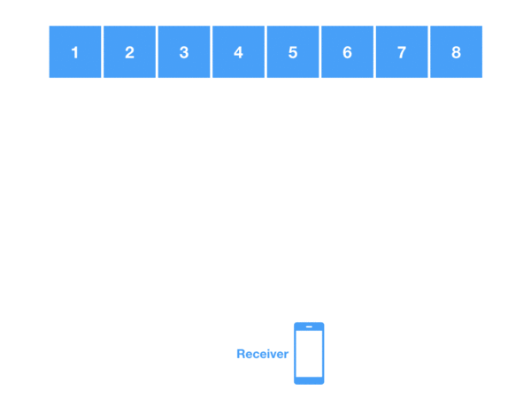
</p>

### L'implémentation AirQR : RaptorQ

AirQR utilise **RaptorQ** (via la crate Rust `raptorq`), l'évolution des fountain codes. Contrairement aux LT codes basiques (que divan utilisait via `gofountain` en Go), RaptorQ garantit le décodage avec un surplus minimal, typiquement moins de 2 % au-delà du minimum théorique.

Chaque paquet est encapsulé avec un en-tête de 10 octets avant de devenir une frame QR :

```
┌──────────────┬──────────────┬──────────────┬─────────────┐
│ TotalSize    │ PacketSize   │ SymbolID     │ Payload     │
│ 4 octets BE  │ 2 octets BE  │ 4 octets     │ variable    │
└──────────────┴──────────────┴──────────────┴─────────────┘
```

En pratique, avec 20 % de surplus, l'encodeur génère **1,2 × K** paquets. Il en faut environ **K** pour reconstruire, soit **~83 % des frames générées** — pas 83 % du fichier source, et l'ordre des paquets n'importe pas. Le GIF boucle à l'infini : on maintient la caméra stable jusqu'à ce que la barre se remplisse. Raté des frames au premier tour ? Le tour suivant apporte de nouveaux paquets de réparation.

---

### Réduire les GIFs : chaque octet compte

Un constat s'est imposé rapidement : la taille du GIF compte pour les performances. Un GIF plus léger, c'est un chargement plus rapide, moins de mémoire, et une meilleure compatibilité.

#### Palette indexée 2 couleurs

Les QR codes sont en noir et blanc, pas en RGBA (4 octets par pixel). AirQR rend les frames dans un **buffer indexé à palette 2 couleurs**, où `0 = blanc` et `1 = noir`.

**Les économies sont massives.** Pour une frame QR de 177×177 pixels (ensuite agrandie à l'affichage, réduite à 177×177 pour le fichier) :

- RGBA : 31 329 × 4 = **125 316 octets** par frame (brut)
- Buffer indexé 2 couleurs : 31 329 × 1 = **31 329 octets** par frame (brut)
- Après compression LZW du GIF : environ **10 000–12 000 octets** par frame

Soit une **réduction d'environ 70 %** de la taille du GIF par rapport à un encodage RGBA.

#### Compression avant encodage

Avant même d'atteindre l'encodeur QR, AirQR peut compresser les données :

- **Côté Rust** : zstd niveau 3 (rapide, streamé par chunks de 1 Mo pour les gros fichiers)
- **Côté navigateur** : deflate niveau 6 (via fflate), mais seulement si ça économise ≥ 10 %

Le flag de compression est stocké dans le premier octet du payload (`0` = brut, `1` = zstd, `2` = deflate), pour que le décodeur sache comment décompresser.

#### Dimensionnement dynamique des paquets

Des paquets plus petits = des QR plus petits = plus faciles à scanner, mais plus de frames. Des paquets plus gros = moins de frames, mais des QR plus denses que les caméras peinent à lire.

Pour les fichiers de plus de ~500 Ko, AirQR agrandit automatiquement la taille de paquet (plafonnée, alignée sur 4 octets pour RaptorQ) afin de viser autour de **2 000 frames** : assez court pour rester scannable, assez dense pour ne pas exploser le GIF.

**Limite actuelle** : le GIF créé pèse encore environ **3× les données utiles** (+200 % d'expansion). La palette 2 couleurs et LZW aident, mais chaque frame reste une image QR complète. Je n'ai pas réussi à descendre plus bas pour l'instant.

---

<a id="encodage-parallele"></a>

## Encodage parallèle

La génération de QR est gourmande en CPU. Une seule frame prend quelques millisecondes, mais 2 000 frames, ça s'additionne. AirQR parallélise ça différemment selon la plateforme.

### Rust (natif / Flutter)

**Rayon** répartit les paquets sur tous les cœurs CPU : chaque cœur encode son lot de QR et rend le buffer indexé, puis les frames sont rassemblées pour le GIF.

### Navigateur (Web Workers + SharedArrayBuffer)

Les frames sont distribuées à un **pool de workers**. Quand `SharedArrayBuffer` est disponible, les workers écrivent directement dans un buffer partagé — zéro copie. Le thread principal assemble ensuite le GIF dans l'ordre.

Sur un ordinateur moderne, encoder 2 000 frames prend quelques secondes. Sur mobile, environ 10 à 15 secondes.

---

<a id="streaming-multi-chunk"></a>

## Streaming multi-chunk

Pour les fichiers volumineux, AirQR découpe les données en **chunks** : plutôt qu'un seul GIF à 100 000 frames, on en a par exemple 10 de 10 000, chacun avec son propre encodeur RaptorQ indépendant.

```
┌──────────────────────────────────────────────────────────────────────────────┐
│ En-tête streaming                                                           │
├────────┬───────────┬─────────┬─────────────┬─────────────┬────────┬─────────┤
│ Mode   │ SessionID │ ChunkID │ TotalChunks │ ChunkOffset │ Total  │ Packet  │
│ 1 oct. │ 4 octets  │ 4 oct.  │ 4 octets    │ 8 octets    │ 4 oct. │ 2 oct.  │
├────────┴───────────┴─────────┴─────────────┴─────────────┴────────┴─────────┤
│ ExactPacketsTotal (4 octets) | SymbolID (4 octets) | Payload variable       │
└──────────────────────────────────────────────────────────────────────────────┘
```

Un paquet manqué du chunk 3 n'affecte pas les chunks 0, 1 ou 2. Les chunks peuvent arriver dans le désordre : le décodeur gère une `HashMap<chunk_id, ChunkDecoder>` et n'assemble le fichier que lorsque tous les chunks sont complets.

<a id="reprise-cross-device"></a>

## Reprise cross-device (optionnelle)

Le cas simple — un écran, une caméra — n'a besoin d'aucun serveur.

Si vous voulez commencer le scan sur un téléphone et continuer sur un autre, un **serveur de synchronisation optionnel** persiste les paquets reçus dans SQLite. Le nouvel appareil interroge le serveur, apprend quels paquets manquent, et ne scanne que les trous. Le protocole WebSocket suit les `lastContiguous`, les plages `missing`, et le `receivedCount`.

---

<a id="stack-technique"></a>

## La stack technique

| Couche | Technologie |
|--------|------------|
| Core encodage/décodage | **Rust** (raptorq, qrcodegen, zstd, image, gif) |
| Interface web | **TypeScript + React + Vite**, WASM via wasm-pack |
| App mobile | **Flutter** avec Rust FFI (flutter_rust_bridge) |
| Serveur de sync (optionnel) | **Python** (stdlib HTTP + websockets, SQLite) |
| Scan QR | Web : API BarcodeDetector / Mobile : mobile_scanner |

Le core Rust compile vers le natif (Flutter) et le WebAssembly (navigateur). Même code, même comportement, partout.

---

<a id="reglages-optimaux"></a>

## Trouver les réglages optimaux

Les benchmarks de divan ont montré que le meilleur résultat était à 11 FPS, chunks de 850 octets, ECC Medium. Les réglages optimaux sont **extrêmement spécifiques** à la paire écran/caméra.

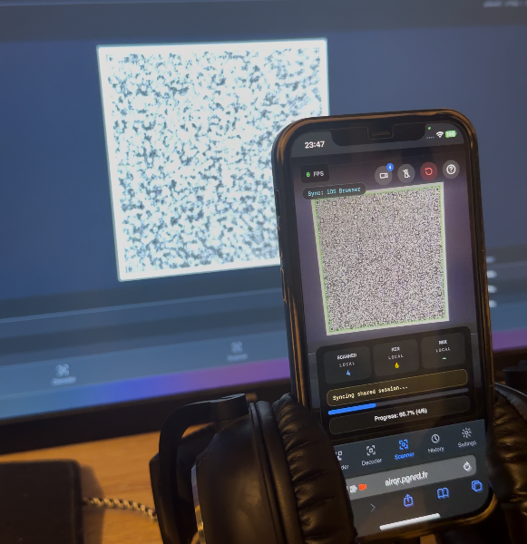

L'espace de paramètres est large :

- **FPS** : 1–30+
- **Taille des paquets** : 100–2 800 octets
- **Niveau ECC** : Low, Medium, Quartile, High
- **Surplus RaptorQ** : 1,0×–2,0×
- **Compression** : activée / désactivée

<a id="benchmark-smart"></a>

### Benchmark Smart : optimisation adaptative en deux temps

Le payload test de 13 Ko est généré une seule fois par session, pour garder une comparaison honnête. L'app enchaîne deux vagues de mesure, nommées **phase 1** et **phase 3**. Il n'y a pas de phase 2 exposée : c'est un héritage de la pipeline interne d'encodage (RaptorQ puis rendu QR), pas une étape du benchmark.

#### Phase 1 : balayage large

Toutes les combinaisons **FPS × taille de paquet × niveau ECC**, soit environ 130 configurations. Pour chacune :

1. Encoder un payload test de 13 Ko en animation QR
2. L'afficher à l'écran au FPS cible
3. Attendre que la caméra le rescanne (timeout de 30 s)
4. Enregistrer le débit (Ko/s), le nombre de frames, la taille du GIF

Pendant la phase 1, le surplus RaptorQ est fixé à 1,2× et la compression est désactivée. L'objectif : trouver quels paramètres *structurels* marchent le mieux sur votre matériel.

#### Phase 3 : optimisation ciblée sur les gagnants

Après la phase 1, l'app prend les **5 meilleures configs par débit** et creuse :

- 5 valeurs de surplus : `[1.0, 1.1, 1.2, 1.5, 2.0]`
- 2 modes de compression : `[brut, deflate]`
- = **50 runs supplémentaires** sur des gagnants déjà avérés

```
Phase 1 :  FPS × TaillePaquet × ECC           → ~130 runs
Phase 3 :  Top5 × Surplus × Compression       → ~50 runs
Total :                                         ~180 runs
```

---

<a id="benchmark-resultats"></a>

## Benchmark & résultats

### 5 560 runs : ce que le matériel a vraiment donné

Les graphes ci-dessous détaillent l'export. Si vous voulez seulement la conclusion pratique, sautez au [tableau de réglages recommandés](#reglages-recommandes).

**En cinq lignes** (paire iPhone 12 / écran 1920×1080, n = 1) :

- Pic reproductible ≈ **8 Ko/s** (~2 s pour 13 Ko) ; le « 111 Ko/s » est un artefact de buffer.
- Plateau large : paquets ~1 500–2 500 o, **12–22 FPS**, ECC **LOW**.
- Les petits paquets paient surtout de l'en-tête ; au-delà de ~2 000 o les gains s'aplatissent.
- Monter l'ECC coûte du débit ; `HIGH` est un impôt ~25 % pour plus de robustesse.
- Deflate perd ici parce que le payload de test est aléatoire ; du JSON réel inverserait souvent la tendance.

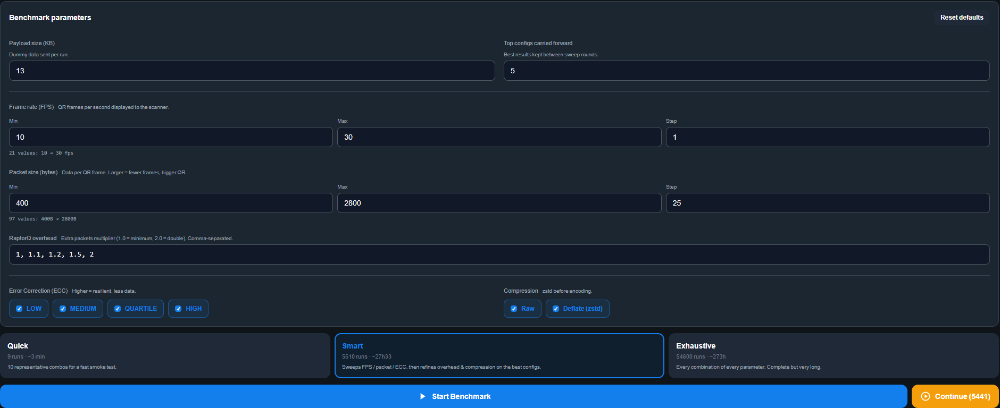

Pour comparer plus directement aux visualisations de divan, j'ai lancé un export bien plus dense que le profil smart léger, puis analysé le CSV.

**Matériel** — 5 560 runs, une seule paire écran/caméra :

- **Scanner** : iPhone 12, Safari, scanner web en mode `autoContinue=1`, caméra arrière grand-angle, éclairage de pièce
- **Affichage** : écran 1920×1080
- **Charge utile** : 13 Ko d'octets aléatoires, générés une fois par session
- **Distance** : ~20 cm, à la main, pincé par mon casque (pas le setup idéal, mais très fonctionnel)

Jeu de données :

- 10–30 FPS, 400–2 800 o par palier de 25 o, 4 niveaux ECC
- **5 460 runs de phase 1**
- **100 runs de phase 3** (`surplus × compression`)

CSV : [`docs/blog/assets/benchmark-5560/benchmark-5560.csv`](https://github.com/Thunzyy/AirQR/blob/main/docs/blog/assets/benchmark-5560/benchmark-5560.csv)

Script des graphes : [`docs/blog/assets/benchmark-5560/generate_charts.py`](https://github.com/Thunzyy/AirQR/blob/main/docs/blog/assets/benchmark-5560/generate_charts.py)

<a id="meilleurs-runs"></a>

### Meilleurs runs

Deux classements utiles : le scan le plus rapide jamais observé, et la config la plus fiable sur la durée.

| Métrique | Config | Temps | Débit | Taille GIF |
|----------|--------|------:|------:|-----------:|
| **Scan isolé le plus rapide** | `12 FPS / 1 175 o / QUARTILE / 1,20× / brut` | **0,117 s** | **111,1 Ko/s** | 52 Ko |
| **Pic reproductible** (meilleure phase 3) | `22 FPS / 2 275 o / LOW / 1,10× / brut` | 1,59 s (meilleur), 2,14 s (médian / 10) | **6,5 Ko/s médian, 8,17 Ko/s pic** | 40 Ko |
| **Meilleure médiane phase 1** (21 repeats) | `22 FPS / 2 275 o / LOW / 1,20× / brut` | 2,73 s médian | 4,77 Ko/s médian, 8,17 Ko/s p95 | 40 Ko |

Deux précisions :

1. **Le « scan isolé le plus rapide » est un artefact.** 0,117 s = une seule frame de caméra. Le téléphone visait déjà un GIF avec K paquets bufferisés d'une boucle précédente ; le décodeur a terminé sur la première nouvelle trame. Reproductible (78, 67, 60, 48 Ko/s sur d'autres runs isolés de la même config), inutilisable comme transport.
2. **Le pic honnête est ~8 Ko/s** : pour 13 Ko, environ 2 s de transfert.

<a id="compare-transports"></a>

### Comparé aux autres transports

| Transport | Débit effectif | 13 Ko | 100 Mo |
|-----------|----------------:|------:|-------:|
| **AirQR** | ~8 Ko/s | ~2 s | ~3 h 30 |
| **NFC** | ~50 Ko/s | ~260 ms | ~35 min |
| **Bluetooth 5 classique** | ~250 Ko/s | ~50 ms | ~7 min |
| **AirDrop** (iPhone 12 ↔ Mac, réaliste) | ~40 Mo/s | < 1 ms | ~2,5 s |
| **Wi-Fi 6** | ~150 Mo/s | négligeable | < 1 s |

Le Wi-Fi est environ **5 000× plus rapide**, et même le NFC gagne. **L'intérêt d'AirQR n'est pas la vitesse** :

- Pas de pairing (pas de discovery Bluetooth, pas de handshake)
- Pas de réseau (pas de Wi-Fi, pas de LAN, pas de DHCP)
- Pas de permissions (pas de prompt AirDrop « tout le monde », pas de profil MDM)
- Pas de drivers (pas de USB, pas de MTP, pas de câble)
- Pas de persistance (la donnée est à l'écran, jamais écrite)

### La surface — FPS × taille de paquet × ECC

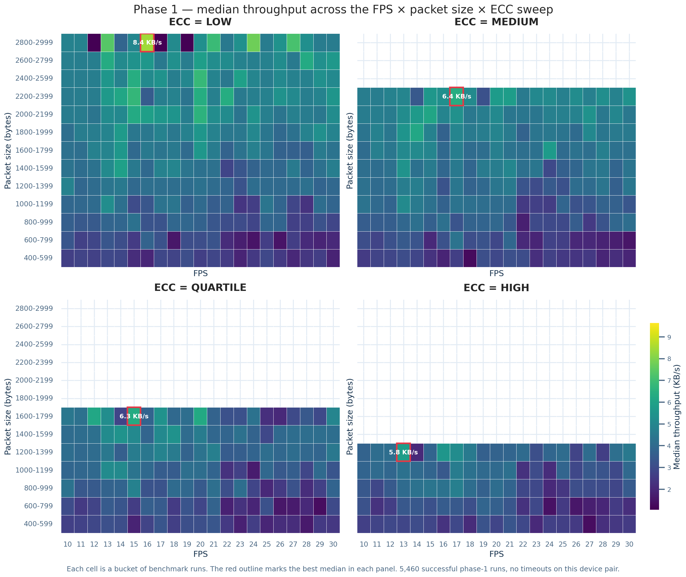

*Chaque cellule est la médiane d'un bucket de runs. Les quatre panneaux partagent la même grille.*

- **La zone rapide est un plateau, pas un point.** Une bande de paquets ~2 000 o entre ~12 et 20 FPS reste à 10 % de la meilleure cellule. C'est ce que les fountain codes offrent face à une boucle fixe.
- **L'ECC supprime des options.** `HIGH` ne peut pas loger de paquets au-delà de ~1 300 o : charge + 30 % de redondance, ça ne rentre plus en QR version 40. Monter l'ECC coûte deux fois : trames plus grosses, moins de paquets par trame.
- **Meilleures médianes sur cette paire** : LOW @ 2 800 o / ~15 FPS ≈ 8,4 Ko/s ; MEDIUM plafonne vers 6,4 Ko/s.

### Temps vs taille de paquet

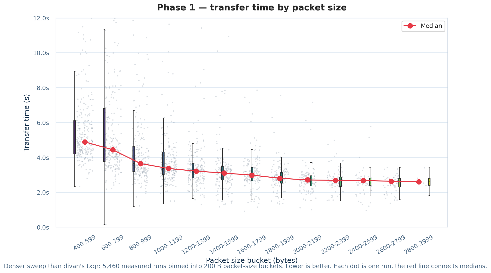

*Plus bas = mieux. Buckets de 200 o ; nuage de points pour la densité ; ligne rouge = médianes.*

- **400–599 o** : médiane ~**4,8 s** — surtout de l'en-tête.
- **2 600–2 799 o** : médiane ~**2,4 s**, presque deux fois plus rapide.
- **Au-delà de ~2 000 o**, le gain est modeste. Si la caméra accroche 1 800–2 000 o de façon fiable, il ne reste pas grand-chose à gratter.

### Temps vs FPS

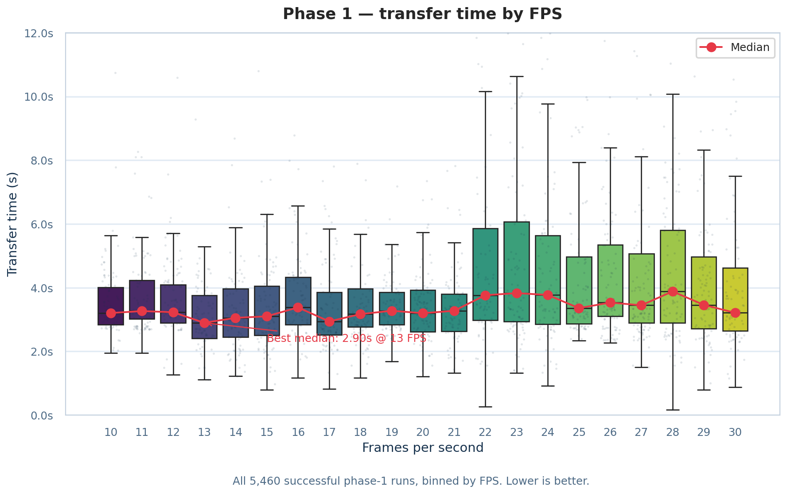

*Plus bas = mieux.*

Le FPS compte, mais moins que la taille de paquet :

- Meilleure médiane à **13 FPS ≈ 2,9 s**, vallée large de 10 à 21 FPS sous 3,5 s.
- **Au-delà de 22 FPS**, les médianes tiennent mais l'IQR s'élargit 2–3×.

### Temps vs niveau ECC

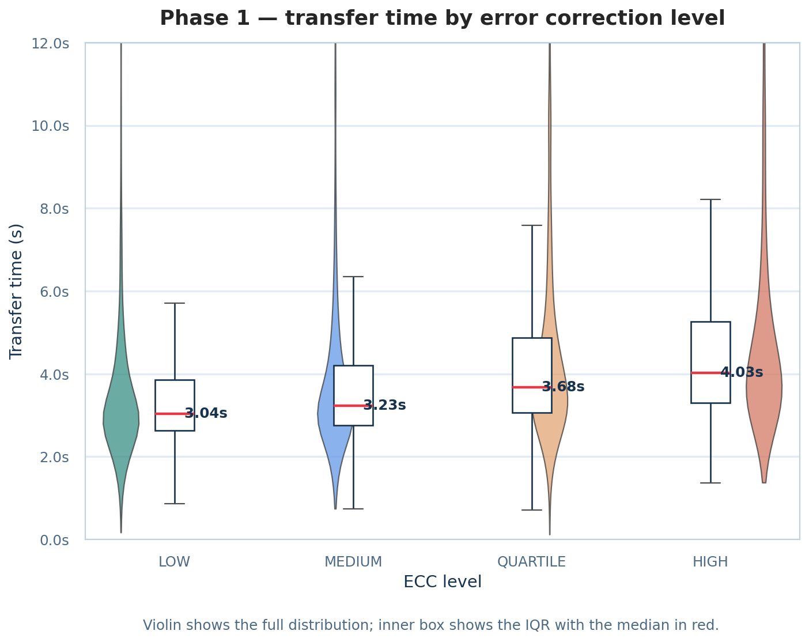

*Violon : distribution complète (coupée à 12 s) ; boîte intérieure = IQR, médiane en rouge.*

| ECC | Redondance | Médiane | vs LOW |
|-----|-----------:|--------:|-------:|
| LOW | 7 % | **3,04 s** | — |
| MEDIUM | 15 % | 3,23 s | +6 % |
| QUARTILE | 25 % | 3,68 s | +21 % |
| HIGH | 30 % | 4,03 s | +33 % |

Faible redondance = gagnant par défaut sur le débit. Subtilité des queues : `HIGH` est plus resserré, donc le *pire cas* est meilleur si la caméra décroche. Compromis fiabilité / vitesse, mesuré.

### Phase 3 — surplus et compression

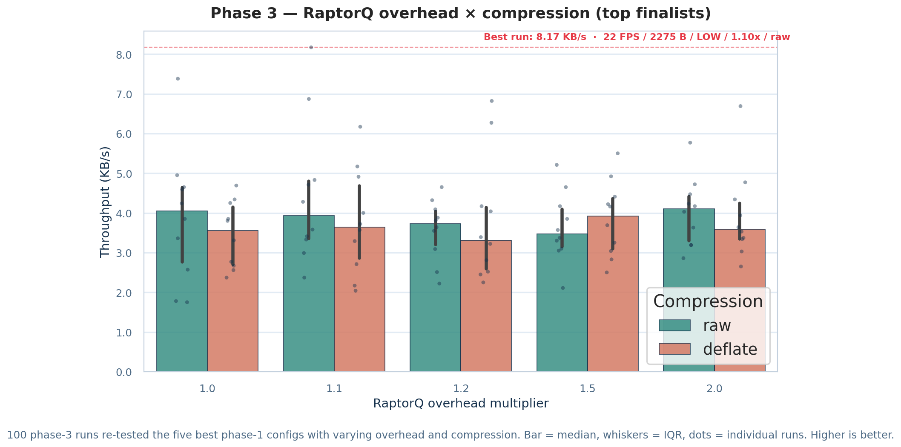

*Barre = médiane sur 10 retries, moustache = IQR, points = runs individuels.*

- **Brut bat deflate dans 4 cas sur 5.** Le payload est 13 Ko d'octets *aléatoires* : deflate n'a presque rien à compresser. Un JSON réel inverserait souvent la tendance — d'où la ligne « texte / JSON » du tableau recommandé plus bas.
- **`1,5× / deflate`** gagne sa colonne : un gros surplus est le moment où compresser commence à payer.
- **Meilleur run isolé** : `22 FPS / 2 275 o / LOW / 1,10× / brut` à 8,17 Ko/s.
- Pour la stabilité plutôt que le pic : **`1,0× brut`** et **`2,0× brut`** ont les IQR les plus serrés.

### Bonus : front de Pareto taille / vitesse

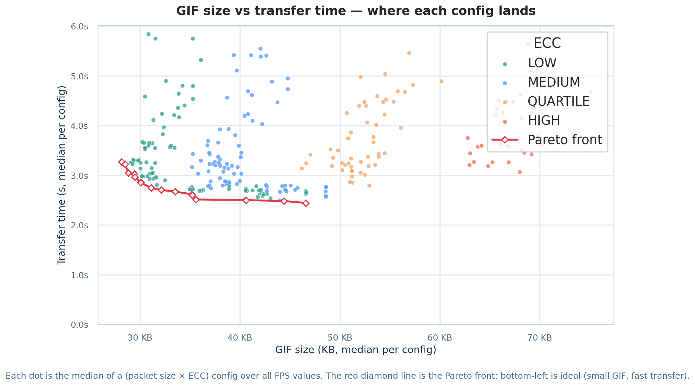

*Chaque point est la médiane d'une config `(taille de paquet × ECC)` sur toutes les cadences. La ligne rouge est le front de Pareto.*

Question pratique : quel temps réel si je veux le plus petit GIF possible ?

- Front de **28 Ko / 3,3 s** (plus petit GIF viable) à **45 Ko / 2,4 s** (plus rapide).
- **Au-delà de ~45 Ko, plus de gain.** QUARTILE et HIGH finissent plus gros *et* plus lents sur une paire coopérative.

### Bonus : plafond réaliste par FPS

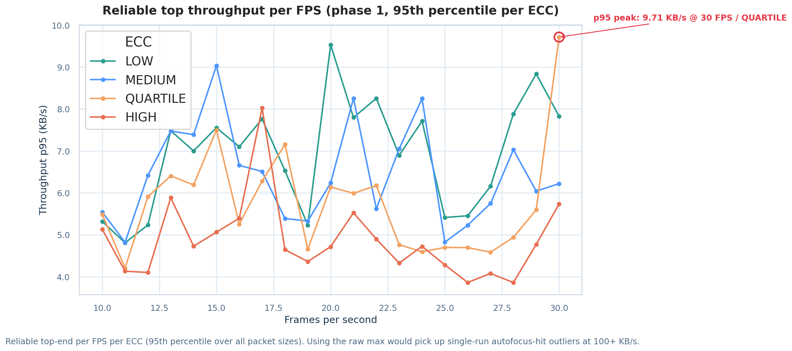

*Pour chaque FPS : 95e percentile du débit sur toutes les tailles de paquet. Le `max` brut capterait des pics one-shot à 100+ Ko/s, pas une capacité reproductible.*

- **LOW** plafonne vers 9,7 Ko/s à 30 FPS — plafond matériel de *cette* paire.
- **MEDIUM et QUARTILE** se croisent selon la cadence.
- **HIGH** ne dépasse jamais 7 Ko/s au p95 : ~25 % d'impôt permanent.

<a id="reglages-recommandes"></a>

### Réglages recommandés (paire iPhone 12 / laptop de ce test)

Ces chiffres ne se généralisent pas à un autre téléphone ou un autre écran — d'où le benchmark intégré. Sur *cette* paire, je mettrais :

| Cas d'usage | FPS | Taille paquet | ECC | Surplus | Compression | Débit attendu | Temps 13 Ko |
|-------------|----:|--------------:|-----|--------:|-------------|--------------:|------------:|
| **Le plus rapide** | 22 | 2 275 o | LOW | 1,10× | brut | ~6,5 Ko/s (médian), 8+ Ko/s (p95) | ~2,0 s |
| **Équilibré** | 12 | 1 175 o | QUARTILE | 1,00× | brut | ~6,0 Ko/s (médian), 7,4 Ko/s (p95) | ~2,3 s |
| **Robuste — phone-to-phone, en mouvement** | 10 | 875 o | LOW | 1,20× | brut | ~3,4 Ko/s (médian) | ~3,9 s |
| **Payload texte / JSON (> 5 Ko)** | 22 | 2 275 o | LOW | 1,10× | deflate | ~5,0 Ko/s (médian) | ~2,6 s |
| **Redondance max — écran sombre, caméra basique** | 10 | 875 o | HIGH | 1,50× | brut | ~2,5 Ko/s (médian) | ~5,5 s |

Règles observées sur tout le balayage :

1. **Commencer en `LOW`.** Sur une paire coopérative, l'ECC bas gagne. Monter en QUARTILE seulement si le scanner galère (mise au point, basse lumière).
2. **Viser 1 500–2 500 o par paquet.** En dessous, on transmet surtout des en-têtes ; au-dessus, les gains s'aplatissent et on sort de la capacité QR hors LOW.
3. **Rester entre 12 et 22 FPS.** Le plateau entier est utilisable ; au-delà, la variance explose sans bouger la médiane. Pour la stabilité, 12–15 FPS.
4. **Surplus RaptorQ : 1,10–1,20×.** En dessous de 1,10× on casse sur la vraie perte de paquets ; au-dessus de 1,20× on paie du temps pour une redondance rarement utile. `1,0×` marche, mais seulement en conditions parfaites.

---

<a id="essayez-des-maintenant"></a>

## Essayez dès maintenant

<p align="center">
  <a href="https://play.google.com/store/apps/details?id=com.airqr.mobile">
    
  </a>
  
  <a href="https://apps.microsoft.com/detail/9P90L5TKGMD5">
    
  </a>
</p>

<p align="center">
  <a href="https://airqr-demo.pgnrd.fr"></a>
  <a href="https://get-airqr.pgnrd.fr"></a>
  <a href="https://github.com/Thunzyy/AirQR/releases/download/v1.0/airqr-portable.html"></a>
  <a href="https://github.com/Thunzyy/AirQR/releases/download/v1.0/AirQR-windows-x64-setup.exe"></a>
  <a href="https://github.com/Thunzyy/AirQR/releases/download/v1.0/AirQR-linux-x64.deb"></a>
  <a href="https://github.com/Thunzyy/AirQR/releases/tag/v1.0"></a>
  <a href="https://github.com/Thunzyy/AirQR/blob/main/docs/deployment/README.md"></a>
</p>

Le code source est sur [GitHub](https://github.com/Thunzyy/AirQR) :

```bash
git clone https://github.com/Thunzyy/AirQR.git
cd AirQR
```

- **Démo en ligne** : [airqr-demo.pgnrd.fr](https://airqr-demo.pgnrd.fr)
- **Téléchargements** (Android, Windows, Linux, HTML portable — iPhone bientôt disponible) : [get-airqr.pgnrd.fr](https://get-airqr.pgnrd.fr)
- **Windows** : [Microsoft Store](https://apps.microsoft.com/detail/9P90L5TKGMD5)
- **iPhone** : ~~App Store~~ — **Coming soon**. Utilisez la [démo web](https://airqr-demo.pgnrd.fr) dans Safari en attendant.
- **HTML portable déjà compilé** : [airqr-portable.html](https://github.com/Thunzyy/AirQR/releases/download/v1.0/airqr-portable.html)
- **Releases binaires** : [AirQR v1.0](https://github.com/Thunzyy/AirQR/releases/tag/v1.0)
- **Guide d'installation** : [`docs/deployment/README.md`](https://github.com/Thunzyy/AirQR/blob/main/docs/deployment/README.md)

### Web

```bash
cd apps/web && npm ci && npm run dev
# Ouvrir https://localhost:5173
```

### Docker

```bash
docker compose up -d --build
# Ouvrir http://localhost:8081
```

### Portable (zéro installation)

```bash
python build/web_singlefile.py
# Ouvrir dist/web-singlefile/airqr-portable.html — un simple fichier HTML
```

Diagrammes mermaid :

- [Architecture](https://github.com/Thunzyy/AirQR/blob/main/docs/architecture/README.md) — point d'entrée
- [DIAGRAMS.md](https://github.com/Thunzyy/AirQR/blob/main/docs/architecture/DIAGRAMS.md) — vue d'ensemble du système
- [ENCODE_DECODE_DIAGRAMS.md](https://github.com/Thunzyy/AirQR/blob/main/docs/architecture/ENCODE_DECODE_DIAGRAMS.md) — encode / decode
- [MAP.md](https://github.com/Thunzyy/AirQR/blob/main/docs/architecture/MAP.md) — index de tous les diagrammes

---

<a id="prochaines-etapes"></a>

## Prochaines étapes

- **Capture haute fréquence** : mode ralenti de l'iPhone (240 fps) comme scanner
- **FPS adaptatif** : ajuster la cadence de l'animation selon le retour de scan en temps réel
- **QR codes couleur** : canaux de couleur pour multiplier la densité par frame
- **Repli WebRTC** : quand les deux appareils ont du réseau, sauter le QR
- **Meilleure compression GIF** : le plus gros levier restant — idées bienvenues

<a id="a-retenir"></a>

## Ce qu'il faut en retenir

1. **Les fountain codes rendent le QR animé praticable.** Sans eux, une frame manquée bloque tout. Avec RaptorQ, n'importe quels K+ε paquets reconstituent les données.

2. **Les réglages optimaux dépendent du matériel.** Il n'existe pas de « meilleur FPS » universel. Le benchmark smart répond pour *votre* paire écran/caméra.

3. **La taille du GIF est le goulot.** L'indexation 1 bit coupe 50–70 %, mais il reste de la marge. Si vous avez des pistes, [ouvrez une issue](https://github.com/Thunzyy/AirQR/issues).

4. **Parfois le transport le plus bête gagne.** Pas de pairing, pas de réseau, pas de drivers, pas de permissions. Juste une caméra pointée vers un écran.

<a id="remerciements"></a>

---

[Code source](https://github.com/Thunzyy/AirQR) · Licence MIT
