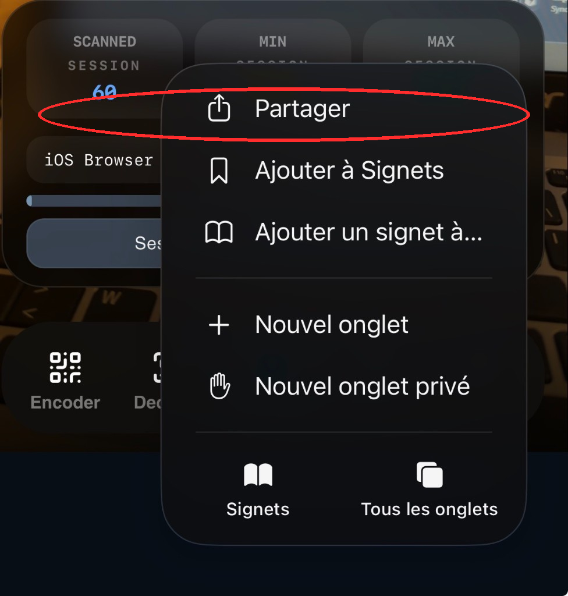
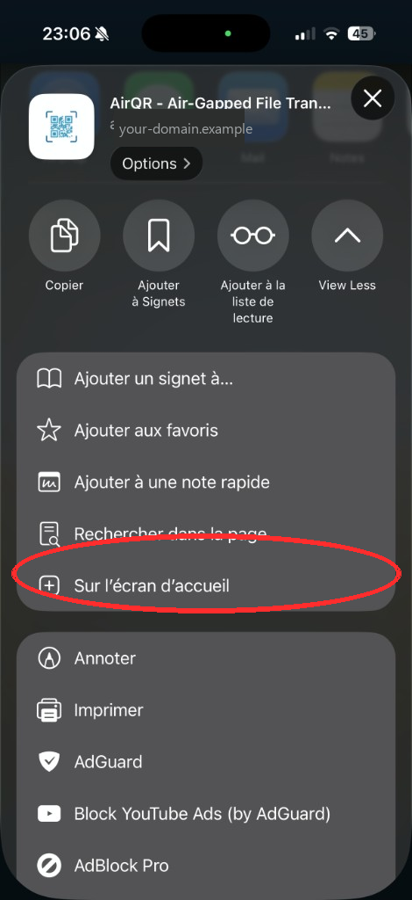

# AirQR Install and Deployment Guide

## Start Here

Pick the case that matches what you want:

- [I just want to use AirQR on my own machine](#i-just-want-to-use-airqr-on-my-own-machine)
- [I want to add the web app to the home screen](#i-want-to-add-the-web-app-to-the-home-screen)
- [I want the web app only](#i-want-the-web-app-only)
- [I want a self-hosted sync-server with Docker](#i-want-a-self-hosted-sync-server-with-docker)
- [I want to connect Settings to an external sync-server](#connecting-to-an-external-sync-server-from-settings)

## What AirQR Needs

AirQR can run in two modes:

- without sync-server
  Good if you only want local encode/decode usage
- with sync-server
  Needed if you want shared history, scan resume across devices, or a central server

If you only want to try the project locally, start with the first section below.

## I Just Want to Use AirQR on My Own Machine

This is the easiest path.

### Windows

From the repo root:

```bat
start.bat -prod -http
```

What this does:

- starts the built web frontend
- starts the local sync-server
- serves everything on `http://localhost:8081`

If you want hot reload for development instead:

```bat
start.bat -dev -http
```

### Linux or macOS

From the repo root:

```bash
./start.sh -prod -http
```

For development mode:

```bash
./start.sh -dev -http
```

### Create the first login automatically

The launchers expose the sync-server beyond loopback, so a fresh install needs
authentication before it can start. Put real credentials in your local `.env`:

```env
AIRQR_BOOTSTRAP_USERNAME=admin
AIRQR_BOOTSTRAP_PASSWORD=replace-with-a-long-random-password
```

Behavior:

- if both values are missing, nothing happens
- if only one value is set, startup fails
- if both are set and the authentication database has no valid user or API key,
  the bootstrap user is created automatically
- if any valid authentication principal already exists, nothing is changed

Use [`.env.example`](../../.env.example) as the starting point. Do not deploy the
sample password. Alternatively, create a user first with
`python services/sync-server/server.py --create-user admin --password "..."`.
First-user setup is never accepted over HTTP, even on loopback, because a local
peer cannot be distinguished reliably from a reverse proxy or SSH tunnel.
Bootstrap with the environment variables above or `--create-user` before
opening the app. Existing deployments that used `--allow-first-user-setup` must
remove that retired flag and bootstrap credentials before restarting.

### What you should see

After startup:

1. Open `http://localhost:8081`
2. Encode a small file
3. Confirm the preview appears and the GIF can be downloaded
4. If sync is enabled, confirm you can log in

## I Want to Add the Web App to the Home Screen

Adding AirQR to the phone home screen gives a better experience: one-tap
launch, full screen without the browser bar, and more room to show or scan
the animated QR codes.

Open the web app in the phone browser at **your own HTTPS domain**, for
example `https://airqr.example.com`.

### iPhone and iPad (Safari)

Safari is the recommended path. After you add it, AirQR opens like an app,
without the address bar.

1. Open your AirQR URL in **Safari**.
2. Open the tab menu, then tap **Share** (`Partager`, circled in red).

<p align="center">
  
</p>

3. In the share sheet, scroll to **Add to Home Screen** (`Sur l'écran d'accueil`, circled in red).

<p align="center">
  
</p>

4. Check the name **AirQR**, then tap **Add**.
5. Launch AirQR from the new home-screen icon.

If **Add to Home Screen** is missing, open the site in Safari itself (not an
in-app browser), then scroll the full share list.

### Android (Chrome)

1. Open your AirQR URL in **Chrome**.
2. Tap the **⋮** menu.
3. Choose **Install app** or **Add to Home screen**.
4. Confirm.

After install, AirQR opens without the browser chrome. Camera and file access
still work as they do in the browser. Remove the icon with a long-press if you
no longer want it; browser data is not always deleted with the icon.

## I Want the Web App Only

Use this if you do not care about the sync-server.

From `apps/web`:

```bash
npm install
npm run dev
```

Open the printed URL, usually `https://localhost:5173`.

For a production build:

```bash
cd apps/web
npm ci
npm run build
```

The output is written to `apps/web/dist/`.

### Publishing the build on a static host

`apps/web/dist/` is a plain static bundle, so any static host works: Nginx,
Caddy, Cloudflare Pages, GitHub Pages, an object storage bucket. Example with
Cloudflare Pages:

```bash
cd apps/web
npm ci
npm run build
npx wrangler pages deploy dist --project-name your-project --branch main
```

One rule matters whatever the host: if the app is served over HTTPS, the
sync-server must also be reachable over HTTPS, otherwise the browser blocks the
requests as mixed content.

### Standalone HTML files

If you want files you can open directly or share as artifacts:

```bash
python build/web_singlefile.py
python build/encoder_linksite.py
```

This creates:

- `dist/web-singlefile/airqr-portable.html`
  Full offline web app in one file
- `dist/web-singlefile/airqr-encoder-linksite.html`
  Smaller standalone encoder page for files, folders, and notes

## I Want a Self-Hosted Sync-Server with Docker

This is the easiest self-hosted server path.

From the repo root:

```bash
cp .env.example .env
# Edit .env and set real, non-empty AIRQR_BOOTSTRAP_USERNAME/PASSWORD values.
docker compose up -d --build
```

By default:

- the sync-server is exposed on `8081`
- persistent data is stored in the Docker volume `airqr-data`
- the web frontend is built into the image during `docker compose build`

### Useful `.env` values

```env
AIRQR_PORT=8081
AIRQR_BOOTSTRAP_USERNAME=admin
AIRQR_BOOTSTRAP_PASSWORD=replace-with-a-long-random-password
TZ=Europe/Paris
```

Then start again:

```bash
docker compose up -d --build
```

On a fresh volume, set both bootstrap values before the first public start. The
Compose file passes them through but never enables `--allow-unauthenticated`.
The server inspects the mounted users database and fails closed with an actionable
error if neither bootstrap credentials nor a valid stored user/API key is
available. On later starts the variables may be omitted when that database is
already valid. Keeping them set is also safe: bootstrap runs only while the
authentication database is empty, so later credential rotation cannot
resurrect the original bootstrap account.

### Authentication migration for existing deployments

Non-loopback sync-server binds now fail closed. Before upgrading, make sure the
persistent users file contains a valid user/API key, or provide both bootstrap
variables. The explicit `--allow-unauthenticated` flag bypasses this protection
and leaves the sync API open; use it only as a deliberate, temporary opt-out in
an isolated environment, never as the default deployment fix.

Logging out or replacing account credentials revokes every browser session and
remember token for that user. Expect other signed-in browsers to authenticate
again after either action.

When using a reverse proxy, configure its exact IP/CIDR with `--trusted-proxy`
and forward the client chain using `Forwarded` or `X-Forwarded-For`. The server
accepts those headers only from configured proxy peers and uses the validated
client address for authentication rate limits. Headers sent directly by an
untrusted client are ignored.

## Connecting To An External Sync Server From Settings

In AirQR Settings, set Server URL to the sync-server origin, for example:

- `https://airqr.example.com`

Enter the server username/password, then click Connection. Settings exposes username/password fields; API keys are for API clients or preconfigured client config. For an AirQR page loaded over HTTPS, use an HTTPS sync-server URL or configure `same-origin` behind the HTTPS reverse proxy. Do not paste a private HTTP backend URL into Settings. If Connection reports an external server or CORS error, verify the sync-server is reachable, auth is enabled, and the request targets `/api/*`.

## Final Checklist

Before you consider the install done:

1. Open the exact URL you expect real users to use.
2. Encode a small file and confirm the preview works.
3. Download the result and verify it opens.
4. If the sync-server is enabled, log in and verify one upload or scan works end-to-end.
5. Confirm the server startup logs include:
   - `server.retention ...`
   - `server.start ...`

## Related Docs

- [Root README](../../README.md)
- [Sync-server README](../../services/sync-server/README.md)
